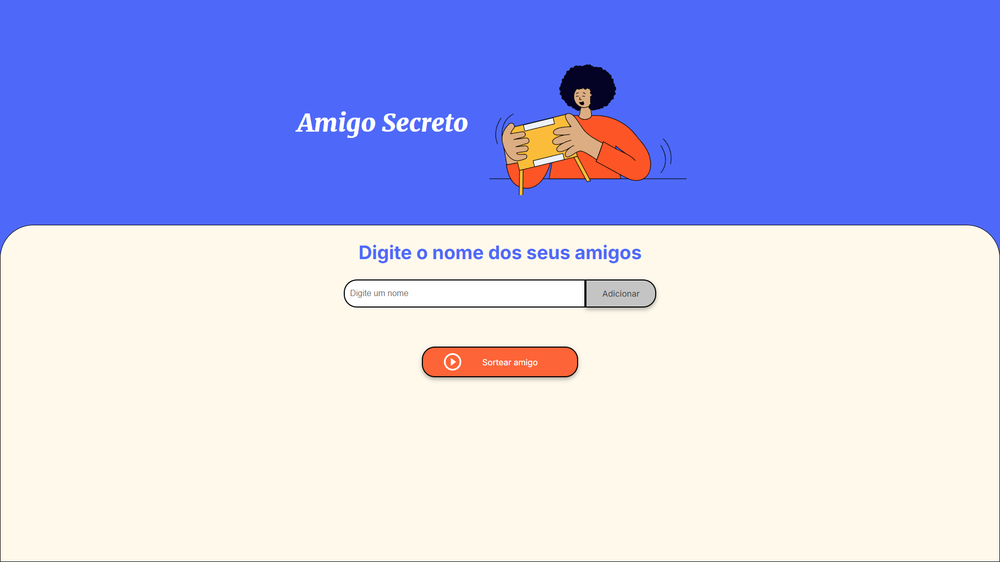

# 🎁 Amigo Secreto 

<p align="center">
  
  
  
  
</p>

Bem-vindo ao **Amigo Secreto** 🎉!  
Este é um projeto **simples e interativo** que permite adicionar nomes de participantes e sortear automaticamente os pares de amigo secreto! Ele foi desenvolvido utilizando **HTML, CSS e JavaScript** de forma responsiva.

---

## 🛠️ Tecnologias Utilizadas

- 🎨 **HTML5, CSS3** – Estruturação e estilização da interface.
- ⚡ **JavaScript** – Manipulação do DOM e lógica do sorteio.
- 📱 **Design Responsivo** – Adaptável para desktop e mobile.

---

## 📸 Preview

<p align="center">
  
</p>

---

## 🎮 Como Usar

1️⃣ **Clone o repositório**  
```bash
git clone https://github.com/seu-usuario/amigo-secreto.git
